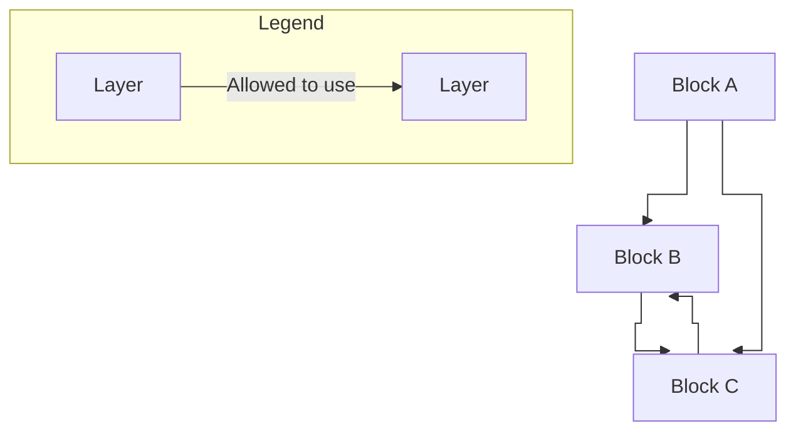

# 07. Security. Auth

### 1. What is the difference between authentication and authorization?

answer

### 2. What authorization approaches can you list? What is role-based access control?

answer

### 3. What exactly is Identity Management (Identity and Access Management)?

answer

### 4. What authentication/authorization protocols do you know? What is the difference between OAuth & OpenID?

answer

### 5. What is Authentication/Authorization Token. What is JWT token? What other approaches except authentication/authorization, can we use with security token?

answer

### 6. What is Single Sign-On (SSO)? Name the steps to implement SSO. What are the benefits of SSO?

answer

### 7. What is the difference between Two-Factor Authentication and Multi-Factor Authentication?

answer

### 8. Which of the OAuth flows can be used for user (customer) and which for client (server) authentication?

answer

---
# 06. Message-based architecture

### 1. What is Message Based Architecture? What is the difference between Message Based Architecture and Event Based Architecture?

MBA is a design approach where different components of an application communicate by exchanging messages instead of synchronous calls or share method invocation.
EBA based on events that represent some changes in the system that need to be handled (system reacts to them in real time)  
So these approaches both utilize messages, but their purpose and level of coupling differ.
EBA is primarily concerned with propagating state changes, and its not expected there these changes will be tracked and handled by someone (more decoupled approach),
whereas MBA is about a wider range of messaging patterns (commands, queries and events) with expectation that a specific topic/queue will be read. 

### 2. What is Message Broker? How do message brokers work?

MB is a kind of an intermediate service (middleware) that routes, transforms and delivers messages between producers and consumers. It accepts messages, persists/queues them, applies routing/filters/transformations, retries/delivers to consumers, and supports durability, ordering, and delivery guarantees (at-most-once, at-least-once, exactly-once where supported). 

### 3. When should you use message brokers?

In cases asynchronous communication between services is required; decoupling microservices; reliable delivery and retry, buffering for slow consumers, and implementing pub/sub patterns.

### 4. Name and describe any distribution pattern.

 Publish–Subscribe is an example of disctribution pattern. Producers publish to a topic; multiple subscribers independently receive copies. Decouples producers and consumers and enables broadcasting of events or notifications.

### 5. What are the advantages and disadvantages of using message broker?

Advantages: decoupling, scalability, resilience (retry/dead letter queue), async processing. 
Disadvantages: complexity, latency, message content & version coordination and consistency control, harder to debug.

### 6. What is the difference between Queue and Topic?

Queue - point-to-point, each message is consumed by one consumer. Cannot be re-read if no retention/DMQ is supported.  
Topic - pub-sub schema, delivery to all subs (broadcast). Messages can be re-read using different offsets.

### 7. What are the typical failures in MBA? How can you address them? What is Saga pattern?

Typical failures are Message Broker Architecture (MBA) typical failures include message loss, duplicate delivery, consumer crashes, and broker bottlenecks. Address them by implementing retries with backoff, making consumers idempotent, using Dead Letter Queues (DLQs), and adopting the Saga Pattern for managing multi-service business workflows.  
Saga is a pattern for managing distributed transactions as a sequence of local transactions. The name is inspired by concept of "saga" in literature - a long complex story involving multiple events and characters.  
This is an approach of splitting a large transaction into a series of smaller, independent steps (local transactions), each performed by a different service. After each step, a message or event is sent to trigger the next step.  
If a step fails, compensating transactions are executed to undo the previous steps, ensuring data consistency across services.  
There are two main types of SAGA execution:  
1. Choreography: Each service listens for events and triggers the next action.
2. Orchestration: A central coordinator tells each service what to do next.

---
# 05. RESTful Web API

### 1. Explain the difference between terms: REST and RESTful. What are the six constraints?

REST is an architectural style for distributed systems (typically - for Web APIs) based on a stateless, client-server interaction using a uniform interface. 
RESTful refers to applications or APIs that implement REST principles (this way they *are* RESTful)

The six constraints are
* Client-Server - separation of responsibilities (client is for UI and user state, server is for data storage and business logic)
* Stateless - name speaks for itself - server doesn't have any state. Each request contains all the information to process it. Useful for scaling and reliability 
* Cacheability - caching shall be applied to resources when applicable, and then the responses must explicitly indicate whether they can be cached (e.g. using HTTP Cache-Control and Expires). Caching can be implemented on the client side or somewhere in the middle (like proxy). Improves performance.
* Layered System - can combine a couple of layers (cache, auth, logic) into one, the client may even not know about these "intermediaries". Increases scalability and security.
* Uniform interface - using JSON or XML for data or a kind of a unified contract between client and server. That "contract" means resource identification by URI, usage of standardized operations through HTTP methods - GET, POST, PUT, DELETE and so on; self-descriptive messages (e.g. with status codes) and HATEOAS implementation.  Makes standard universal to use. 
* Code on Demand (Optional, rarely used) - to support things such as widgets. Server can send executable code (e.g. JS) to the client for extension or customization of client behavior.

### 2. HTTP Request Methods (the difference) and HTTP Response codes. What is idempotency? Is HTTP the only protocol supported by the REST?

The operation may be considered idempotent if it's execution leads to same result. 
HTTP Request method - is a description of operation client wants to perform on a resource.

| Method  | Description                                                                           | Idempotency                                                                        |
| ------- | ------------------------------------------------------------------------------------- | ---------------------------------------------------------------------------------- |
| GET     | Retrieve a resource. No request body required. Should not change state                | Yes                                                                                |
| POST    | Create or update a resource. Has request body                                         | No (repeating the same request will create multiple resources)                     |
| PUT     | Replace the **whole** resource at a specific URI (in some APIs - create if not exist) | Yes (replacement of same value leads to same result)                               |
| DELETE  | Remove a resource                                                                     | Yes, if deletion of already-deleted resource is treated as success                 |
| PATCH   | Partial update. Unlike PUT, makes **little** updates in a resource - "patches"        | Depends. A patch that replaces a string is idempotent, but value increment is not. |
HTTP Response code - is a description of result of the operation ("whether the action succeeded and why) as a part of server reply.
There are 5 HTTP response codes levels (and popular examples)
* 1XX - Informational
* 2XX - Success (200 OK, 201 Created)
* 3XX - Redirection
* 4XX - Client error (400 Bad Request, 401 Unauthorized, 403 Forbidden, 404 Not Found)
* 5XX - Server error

There are holywars about what to return, e.g. GetById may "return 200 + empty array" or "404" - based on strategy chosen on a project (to my mind, filtering by route parameter items/123 can return 404 but items?id=123 may return 200+empty array).

REST is an architectural style, so it's designed not just for HTTP. HTTP is the most popular transport for RESTful APIs as it follows all the REST constraints. The other commonly mentioned options are FPT, SMPT, sometimes WebSocket.

### 3. What are the advantages of statelessness in RESTful services?

Scalability and simplicity mostly. Any server node can handle any request, so it makes horizontal scaling easier - this way we also have better fault tolerance. Performance and maintainability also take place because of simplification - server doesn't need to manage session state or synchronize client data across requests.

### 4. How can caching be organized in RESTful services?

It can be organized on server side (cache DB results, computed responses, etc; or usage of distributed cache like Redis) and client side (when a resource is marked as cacheable).

### 5. How can versioning be organized in RESTful services?

Most popular ways are URL-based, header-based, query-params based. Another way is domain based (v1.api.myapp.com)

### 6. What are the best practices of resource naming?

Based practices are
* Use nouns for resources: /items, /users, not /getUserById
* Use plural for collections: /items not /items
* Use HTTP verbs for actions instead of verbs in the URL.
* Use query parameters for filtering, sorting and pagination
* Keep URLs simple, readable, avoid deep nesting.

### 7. What are OpenAPI and Swagger? What implementations/libraries for .NET exist? When would you prefer to generate API docs automatically and when manually?

OpenAPI is a specification for describing APIs in a machine-readable format (JSON, YAML). Swagger is a set of tools for implementing and utilizing the OpenAPI specification. For example, generating the OpenAPI spec JSON file, and creating a test UI for it. Swashbuckle is the only one I've ever used, but there are also NSwag and Microsoft.AspNetCore.OpenApi. 

Well, it's always easier to generate a documentation automatically, no need to worry about manual support.

### 8. What is OData? When will you choose to follow it and when not?

Open Data Protocol is a REST-based protocol for building data-driven APIs that support rich querying (filtering, sorting, pagination,projections). It defines Entity Data Model which is obviously indended to be used for querying some entities. It also specifies the CRUD operations. So that all combined makes it useful for apps that heavily operate with data objects. 

When to use - there is a data-driven backend with need in exposion of powerful, flexible querying without designing many custom endpoints. Useful for reporting, admin tools, etc. 

When NOT to use - in cases with tightly controlled endpoints, custom business rules or limited client querying (because of security and performance reasons)

### 9. What is Richardson Maturity Model? Is it always a good idea to reach the 3rd level of maturity?

RMM is a set of grades for how is API RESTful. Has 4 levels:
* level 0 - Swamp of POX". Single URI, single HTTP method (usually POST), mutiple logical operations in one endpoint.
* level 1 - Resources. Each endpoint corresponds to a specific resource (/items, /users). Every URI has one responsibility
* level 2 - HTTP verbs and standard status codes usage.
* level 3 - HATEOAS. Hypermedia as the engine of application state. Responses include hypermedia links for clients to discover and navigate the API dynamically.

Usually most APIs stop at level 2, because strict following level 3 may overkill simple APIs or internal services with not a wide set of operations over the resource.

### 10. What does pros and cons REST have in comparison with other web API types?

It is simple, widely understood (HTTP verbs, status codes, JSON format commonly), scalable and cache-friendly. Supports lot of tools (OpenAPI, Swagger, Postman, etc) and libraries for multiple languages. Statelessness is a big advantage.
At the same time, it may be over-fetching or under-fetching (return more or less data then the client needs), GraphQL may be for flexible here. Statelessness may be another downside when it's necessary to have a state obviously. Or another case is streaming data: REST is not designed for that.

---
# 04. Layered Architectures

### 1. Name examples of the layered architecture. Do they differ or just extend each other?

N-layer, Onion, Hexagon.

N-layer is about splitting UI, BL and DAL and making them be dependent only one way (UI on BL, DAL on BL).  

Onion is about having Domain layer (entities, value objects, exceptions) as core, the application-wide layer containing the application-specific logic, and the layers interacting with the app (UI, Infrastructure, APIs).

Hexagon (ports and adapters) specifies the separate parts that talk with the "outside world". These are called ports, and the adapters are separate parts that interact with the app through ports. The specific part is, again, the fact that the adapters (and in some implementations the ports too) are autonomous and separate (separate UI apps or outer APIs).  

The main idea in all three is the same: dependencies should point inward, not outward. These items can be useful in specific cases (like UI migration, DB replacement), and the choice depends on Domain complexity and extensibility/testability requirements.

### 2. Is the below layered architecture correct and why? Is it possible from C to use B? from A to use C?

By "correct" layered architecture we mean the one where: 
* Dependencies should be one‑way “downward”: higher layers can use lower layers, but NOT the other way round.
- A “layer” typically means a horizontal concern group (e.g., A, B, C are layers), and each layer should only know about layers below it, never about layers above it.

The architecture in the diagram in not correct because there are some dependency‑flow rule violations:
* C uses B. Lower layer depends on higher. This is a classic example of circular dependency which is not allowed in layered architecture.
- A uses C directly bypassing B. A layer-skipping dependency which also breaks classic layered architecture.

So, in a layered (not modular) architecture  
* C can't use B - that will possibly lead to issues in maintaining  
* A can't use B, it's recommended to pass this reference through the intermediate layer B.  
otherwise we are talking not about a layered architecture but something different (possible spaghetti?)

### 3. Is DDD a type of layered architecture? What is Anemic model? Is it really an antipattern?

The name (Domain Driven Design) says it all: a design which prioritize reflecting the real world business domain in the code with concepts like ubiquitous language, bounded contexts, aggregates, entities, and value objects. DDD is often implemented with layered, onion, or hexagonal architecture but not tied to any of them.

An anemic domain model is a model where domain objects mostly store data, while all meaningful behavior lives in services. For DDD that is usually considered an anti-pattern because it turns the domain objects into passive DTO-like structures with pushing business rules outward. At the same time, anemic model may be acceptable, for example, in the cases with simple domain or the system is mostly CRUD (no complex logic) - the more domain complexity grows the more advantages of DDD are lost.

### 4. What are architectural anti-patterns? Discuss at least three, think of any on your current or previous projects.

Architectural anti-patterns are recurring design mistakes that make systems harder to understand, change, test, or scale - structural problems that affect the whole system. Some of my "well-known" in practice are God object, Circular Dependency, Tight coupling and Spaghetti code.

God object is about some class/module that accumulates too much responsibility, so becomes hard to change because every feature ends up touching it.

Circular dependency is about referencing of two or more modules on each other (dependency), which makes the system fragile and difficult to evolve or test - the practice showed some modules were impossible to test as a result.

At the same time Tight coupling is a problem of business logic directly depending on database, UI, or framework details, so changes in technical concerns leak into the domain.

Spaghetti means that object-oriented language capabilities are ignored and a separate function is written for almost every business process, and only the code author is able to work in it. That way reusage or extension of the code becomes hard to handle.

All of them were mostly solved by following SOLID principles with analyzing the dependencies graph to avoid "leakages".

### 5. What do Testability, Extensibility and Scalability NFRs mean. How would you ensure you reached them? Does Clean Architecture cover these NFRs?

Testability means it’s easy to check if your system works - it won't require a lot of setups or confusion. To make software more testable, it's required to focus on modularity, encapsulation, loose coupling, high cohesion, clear interfaces, dependency injection, testable architecture patterns (like MVC or Clean Architecture), automated testing support, mocking/stubbing, and good test data management.

Extensibility means new features can be added or changes can be made without breaking everything or rewriting big chunks of code. That is achieved by designing the your system in modules, using clear abstractions, and not hardcoded things. This way changes are local and don’t affect unrelated parts.

Scalability means the system can handle more users, data, or work without slowing down or becoming hard to manage. It’s not just about hardware but also about whether your code and team can grow. Scalability can be improved by making services stateless, using caching, processing things asynchronously, and dividing the system into clear parts.

Clean Architecture helps with all three by separating business logic from frameworks and infrastructure, making things easier to test and extend. It can also help with scalability by making parts easier to replace or split. At the same time CA is not a fix for all the issues but just a tool in a skilled hand, so just one of the things to cover NFR alongside team work & patterns applied.

---
# 03. Architectural Styles and Patterns

### 1. What are the cons and pros of the Monolith architectural style?

The main advantage is having everything in one place  
➕ Understanding is simple during onboarding.  
➕ Development is simple because the code is located in one place with no dependencies.  
➕ Debugging is simple, the flow of specific request is easy tracked within the application.  
➕ Testing is simple - e2e testing doesn't require any additional preparation steps (just run the application and it's ready to test)  
➕ Deployment of a single monolithic unit is also simple, horizontal scaling (multiple instances with load balancer) is supported.  
➕ Good for early stages of application development - when the requirements are not finalized and its not clear what architecture to choose in the future.  

At the same time the "all in one" approach has its disadvantages, especially with codebase growing:  
➖ High code coupling. A big application has tons of code to review & maintain - may lead to spaghetti with difficulties in understanding.  
➖ Its' difficult to split the solution between development teams - code ownership approach cannot be used.  
➖ Low flexibility of technologies. Usage of same version of libraries is usually required for all the monolith items, so the more code (components) is inside - the more time it will take to migrate.  
➖ Application start takes some time, as well as packing and deployment.  
➖ Testing is harder because any change (little or big) leads to full regression for the whole monolith.  
➖ Any change leads to re-deploy of the whole monolith. If the build/deployment pipeline fails for some reason, another run of pipeline will take extra time.  
➖ Performance issues. When the application is scaled horizontally, but the database will probably remain one and same for all the services. Of course query optimization and replication may be done, but these ways of optimization are pretty limited.  

### 2. What are the cons and pros of the Microservices architectural style? 

The main idea of the style is splitting into a set of smaller services (monolithic applications) with ability of interactions between each other if needed. So  
➕ High code decoupling achieved, because there are clear responsibilities and bounds between services, what makes them better to understand, review & maintain.  
➕ Code ownership may be applied between development teams - allows parallel work without blocking each other.  
➕ Every service follows its contract (API), so the tech stacks of the service may be different (language, DB type, and so on) but always following the contract. There is no technical dependency (library version and so on) between services, so migration can be done easily within the service.  
➕ Deployment of a single service don't require redeployment of other ones.  
➕ Individual scaling of a single service is possible.  
➕ Fault isolation. If one service crashes or has technical issues (memory leaks) that other services may not face with.  
➕ Polyglot persistence - the service can rely on the type of DB optimal for the service needs (structured/unstructured data and so on).  

But with the number of services growing several problems appear:  
➖ Distributed system complexity: inter-process communication mechanism required, latency, failures, retries and so on become current problems to face with.  
➖ Data consistency is another point to think about. Especially if no transactions applied across services.  
➖ Difficult debugging. The tracing of the request processed across multiple services is a difficult task.  
➖ DevOps efforts to support monitoring, logging, health checks in every service.  
➖ Testing complexity. The inter-service dependency may lead to difficulty testing scenarios and additional preparations (e.g. for e2e or integration tests).  
➖ A single API Gateway is recommended.  
➖ It takes some time to extract services from monolith and split the responsibilities. May be much harder if monolith was not properly organized.  

### 3. What is the difference between SOA and Microservices?

Both rely on the services as the main component but have differences in several aspects  

| Aspect             | SOA (Service-Oriented Architecture)                                                                                                   | Microservices                                                                                                                                   |
| ------------------ | ------------------------------------------------------------------------------------------------------------------------------------- | ----------------------------------------------------------------------------------------------------------------------------------------------- |
| **Sharing style**  | "Share‑as‑much‑as‑possible". Services are designed to be reused across many consumers, often via a shared enterprise bus or registry. | "Share‑as‑little‑as‑possible". Services are small, autonomous, and avoid tight coupling; duplication is accepted to reduce shared dependencies. |
| **Service size**   | Large, enterprise-wide services (often ESB-mediated)                                                                                  | Small, single responsibility (bounded contexts)                                                                                              |
| **Communication**  | Heavyweight protocols (SOAP, WSDL, XML) over Event Service Bus                                                                        | Lightweight through API (REST/JSON, gRPC, async messaging)                                                                                      |
| **Code ownership** | Centralized                                                                                                                           | Teams own their services                                                                                                                        |
| **Technology**     | Often same tech stack, vendor products (Oracle, IBM, etc)                                                                             | Polyglot                                                                                                                                        |
| **Deployment**     | Infrequent, centralized                                                                                                               | Independent, continuous deployment                                                                                                              |
| **Data storage**   | Shared database                                                                                                                       | Database per service, decentralized data                                                                                                        |
| **Philosophy**     | Top-down, enterprise-wide initiative                                                                                                  | Bottom-up, product-orien                                                                                                                        |

### 4. What does hybrid architectural style mean? Think of your current and previous projects and try to describe which architectural styles they most likely followed.

The name says it all - a hybrid architectural style means a style for a system that combines two or more architecture styles (for example, monolith + microservices, or event‑driven + serverless) into a single cohesive design, taking the strengths of each while managing the trade‑offs. So it's not one "pure" style, but a mix with clearly visible signs (advantages) of several styles.

In my current project codebase there is a solution containing several Function Apps (with Azure Functions inside), that use services to manipulate the data in our system and interact with other systems within and outside the corporative network.
This set of Function Apps considered to be supportive to the main low-code MS Dynamics-based application. These apps use services that make requests to Dataverse (Dynamics app DB) or able to do HTTP requests to APIs.

The solution items are divided into a couple of projects: a library with Models (Avro models and DTOs), Dynamics models (and their services), Mapping services, Persistence project containing database services (to work with Postgre and SQL) - that says we follow a clean architecture style with Core, Infrastructure and Presentation (in my case - Entry Points) presented by Function Apps.

The functions are used for integration with other systems using Kafka (using Avro models) or API requests triggered by a specific event in the Dynamics-based app (creation, updates of entities).

These signs tell me our solution is a hybrid of Serverless + Event‑driven + Clean Architecture.

### 5. Name several examples of the distributed architectures. What do ACID and BASE terms mean.

Client-server, Layered Distributed Architecture (with different layers on different machines: UI, API/BL, Data access layer), Event-driven architecture.

Both ACID and BASE describe transaction guarantees in databases.  

ACID is a set of rules for transactions in SQL to guarantee safety, reliability and correctness in a database.

- Atomicity. Every transaction is “all or nothing" - if any part fails, the whole transaction is rolled back.
- Consistency. The database stays in a valid state before and after the transaction (constraints, rules, invariants are preserved).
- Isolation. Concurrent transactions don’t interfere with each other, they look like they run one after another.
- Durability. Once a transaction is committed, its changes survive failures (e.g., stored on disk or replicated).

ACID systems prioritize **correctness and consistency** over availability and speed – great for financial systems, orders, etc., but can be harder to scale horizontally.

BASE is a more relaxed, availability‑oriented model used by many NoSQL databases:

- Basically Available. The system stays available even under partial failures, it may accept requests but return stale or incomplete data.
- Soft state. The system’s state can change over time without external input (e.g., because of replication lag between nodes).
- Eventually Consistent. After all updates stop, the system will eventually converge to a consistent state; it does not guarantee immediate consistency.

BASE systems prioritize **availability, scalability, and performance** over strict consistency – good for user feeds, logs, analytics, and large‑scale distributed services.

### 6. Name several use cases where Serverless architecture would be beneficial.

Serverless is a good style for the applications no need to worry about scaling or long-running infrastructure. Typical usage cases are event-driven architectures (Kafka, Service Bus, etc), batch and background jobs with scheduled runs and POCs implementation - works like "pay as you go".